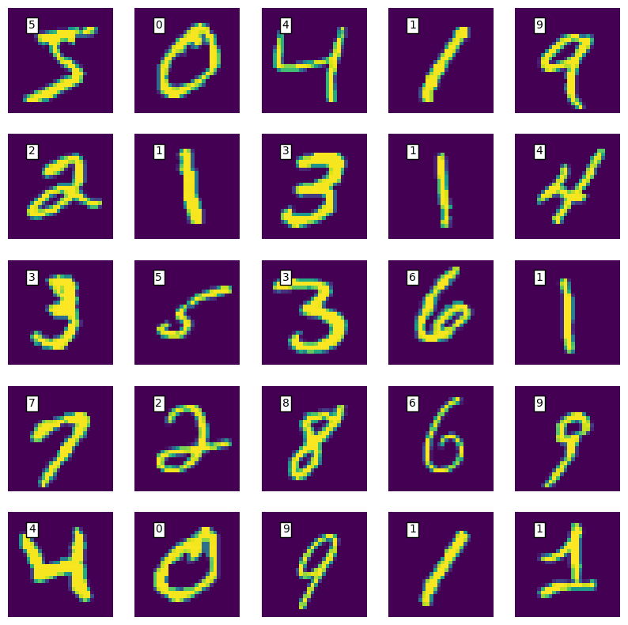
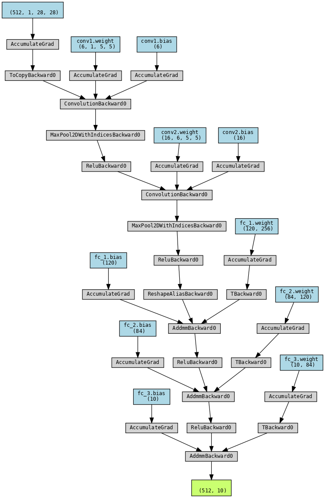
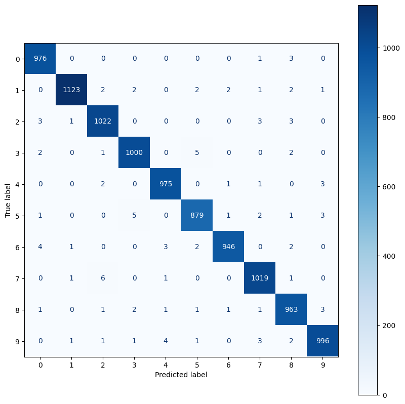

# MNIST ✏️ Handwritten Digits Classification with Convolutional Neural Network

This repository contains the applications for classifiying image of handwritten digits.


# Dataset
The dataset that as been used is the MNIST [Handwritten Digits Dataset](http://yann.lecun.com/exdb/mnist/). If the ```CNN.ipynb``` is going to be used to retrain the model, the data will be downloaded automatically in the parent folder, under a directory named ```.mnist_digits```.

**Label names can be found in the class_names.txt file.**
# Usage
Before running the app, the requirements need to be installed :
```
pip install -r requirements.txt
```
To run the app and use the web version directly, just run this command in a desired terminal and open the hosted app address in a browser.:
```
python app.py
```
**You can then draw the desired digit on the sketchboard and let the Convolutional Neural Network classify it for you.**

# Convolutional Neural Network
## Architecture of the CNN
The CNN is a pretty simple model, which can be changed to get better results. It contains : 
* 2 2D Convolutional layers.
* 2 Fully Connected layers.
* 1 Output layer of size 10.


## Performance
The model achieved an **accuracy of 98.86%** and a loss of 0.036 on the test set.
## Confusion Matrix
